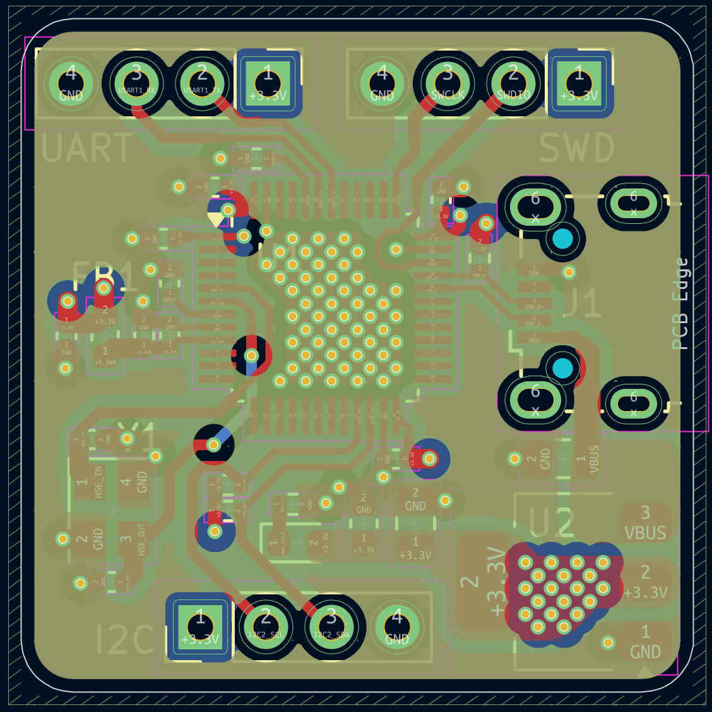
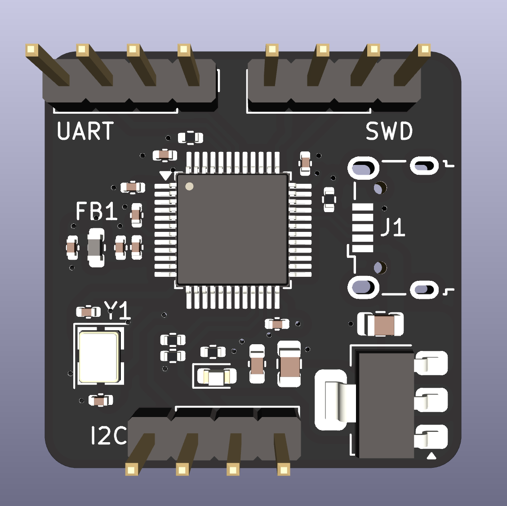
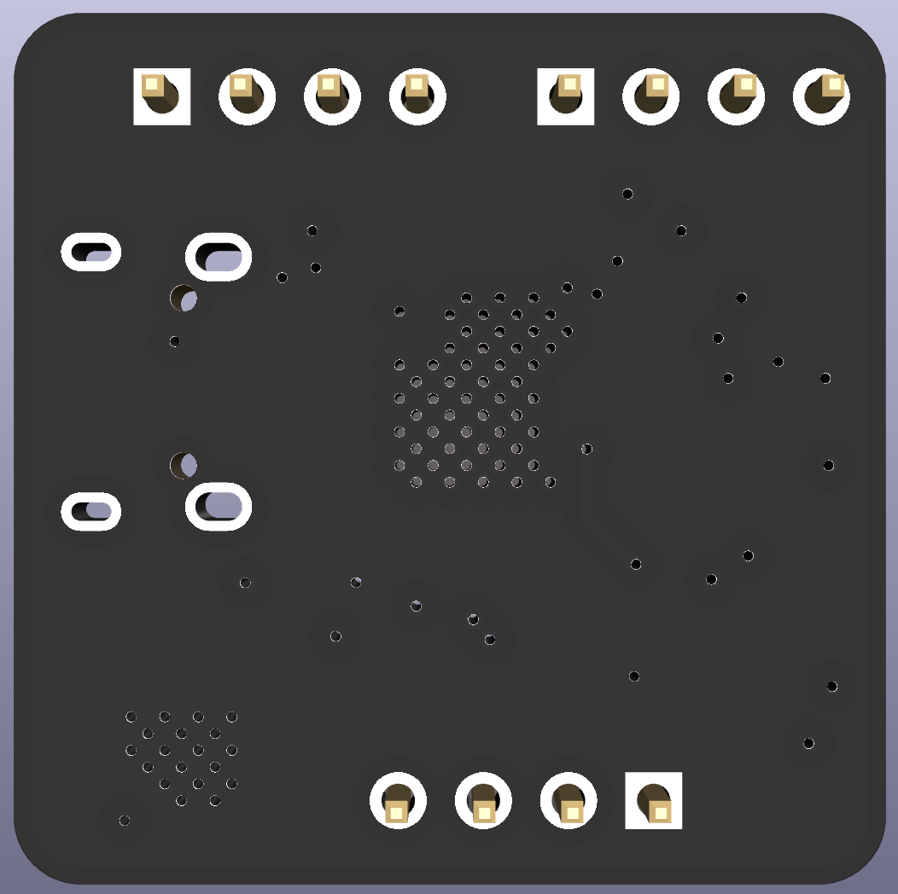

# STM32 dev board [KICAD PCB DESIGN]
This is a 4-layer (sig-gnd-gnd-pwr) STM32F103C8Tx dev board developed in KiCad. 
This design includes SWD, UART, and I2C headers, as well as a USB port.

  
  
  
  
  
  

